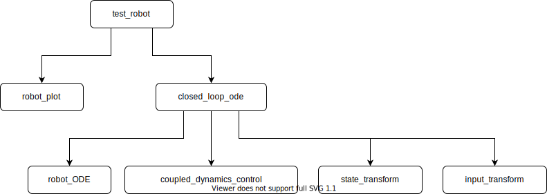

# Decentralized Robot Formation Control Algorithm

This repository implements the algorithm described in R. Lawton, R. W. Beard, B. J. Young, "A decentralized approach to formation maneuvers", IEEE Transactions on Robotics and Automation, vol. 19, no. 6, pp. 933-941, 2003 [link](http://citeseerx.ist.psu.edu/viewdoc/download?doi=10.1.1.123.5697&rep=rep1&type=pdf).

## Function help

All Matlab functions contain a description that can be shown with `help` or `doc` commands.

## Overview of scripts, functions, and classes

### Test scripts

The script `test_robot.m` runs a simulation of the _Coupled Dynamics Formation Control_ algorithm with the specified parameters and displays the results.

The script `test_robot_damping.m` runs a simulation of the _Coupled Dynamics Formation Control With Passivity-Based Interrobot Damping_ algorithm with the specified parameters and displays the results.

The script `test_robot_saturation.m` runs a simulation of the _Saturated Control_ algorithm with the specified parameters and displays the results.

### Transformations

The functions `state_transform`, `input_transform`, and `inverse_state_transform` transform between the original and linearized states and inputs.

### Robot dynamics

The function `robot_ode` implements the ordinary differential equations of multiple robots.

### Control laws

The functions `coupled_dynamics_control` and `coupled_dynamics_control_saturated` implement the normal and saturated control laws.

### Closed loop dynamics

The function `closed_loop_ode` puts together the robot ODEs, transformation, and control law to create the ordinary differential equations of the closed loop.

### Drawing the robot

The class `robot_plot` allows to draw and modify the robot.

## Function hierarchy

The following picture shows the hierarchy of the scripts, functions, and classes.

